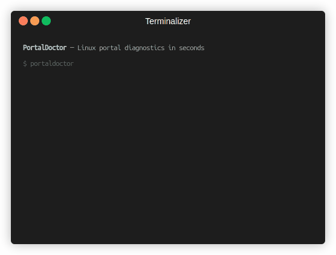

# PortalDoctor

Read-only diagnostics for the Linux desktop portal stack.

[](https://github.com/SetraTheXX/Portal-Doctor/actions/workflows/ci.yml) [](https://crates.io/crates/portaldoctor) [](https://github.com/SetraTheXX/Portal-Doctor/releases) [](LICENSE)

<p align="center">
  
</p>

> Find out why screen sharing, file choosers, and screenshots fail — without digging through five different tools.

PortalDoctor is a deterministic Rust CLI that turns scattered XDG Desktop
Portal, Wayland, D-Bus, and systemd user-session state into one
evidence-backed diagnostic report.

> **v0.1.0** — First public GitHub release. The validated baseline is Ubuntu
> 26.04 with GNOME, Wayland, and a systemd user session.

## Why PortalDoctor?

Desktop portal failures rarely have a single obvious cause. A missing session
variable, an unexpected `portals.conf` preference, an unavailable D-Bus name,
or an unhealthy user service can all surface as the same “screen sharing does
not work” symptom.

PortalDoctor collects those signals in one read-only pass, explains the route
selected for each portal interface, and reports deterministic findings with
evidence and an actionable next step.

| Signal | What it answers |
| --- | --- |
| Session and environment | Is the current Wayland/XDG session coherent? |
| Portal configuration | Which config files and backend descriptors are active? |
| Routing | Which backend is selected for `ScreenCast`, `FileChooser`, and other interfaces — and why? |
| Runtime reachability | Does the portal frontend and selected backend own their D-Bus names? |
| systemd user session | Are discovered portal units present and healthy? |
| Findings | What is wrong, how confident is the signal, and what should be checked next? |

## Quick start

### Install from crates.io

```sh
cargo install portaldoctor --version 0.1.0 --locked
portaldoctor
```

For the latest published version, omit `--version 0.1.0`.

### Build from source

```sh
git clone https://github.com/SetraTheXX/Portal-Doctor.git
cd Portal-Doctor
cargo build --release
./target/release/portaldoctor
```

Normal use is read-only and does not require `sudo` or root access.

## Typical workflow

Start with the default passive check:

```sh
portaldoctor
```

Narrow the investigation when you already know which layer is involved:

```sh
portaldoctor check environment
portaldoctor check portal
portaldoctor portal list
portaldoctor portal routes
portaldoctor portal explain ScreenCast
```

Use verbose output for collected values, route evidence, and full finding
explanations. Use JSON when the report needs to be consumed by another tool:

```sh
portaldoctor check environment --verbose
portaldoctor --json > portaldoctor.json
```

## What it checks

- operating system, desktop, session type, and allowlisted environment values,
- process environment versus the systemd user activation environment,
- effective XDG configuration and data search paths,
- desktop-specific and generic `portals.conf` files,
- `.portal` backend descriptors, interfaces, and provenance,
- interface-specific, default, wildcard, and disabled route preferences,
- D-Bus name ownership for the portal frontend and selected backends,
- basic systemd user-unit state for the discovered portal services,
- 15 deterministic findings across the `ENV`, `XDP`, `CFG`, and `DBUS` families.

## Example

A healthy GNOME/Wayland session produces a compact report like this:

```text
PortalDoctor 0.1.0
Snapshot schema v1

System: Ubuntu 26.04 LTS (ubuntu)
Session: wayland session · desktop ubuntu:GNOME · session desktop ubuntu
Activation environment: consistent (5 variables compared)
D-Bus: connected · portal frontend reachable
  backend org.freedesktop.impl.portal.desktop.gnome: reachable
  backend org.freedesktop.impl.portal.desktop.gtk: reachable

Findings: none detected.
```

When a problem is detected, the default terminal report includes the finding
ID, a concise explanation, and the first actionable `next:` recommendation.
`--verbose` adds confidence, impact, evidence, and all recommendations.

## Design principles

- **Read-only:** collection does not edit configuration, restart services, or
  open portal dialogs.
- **Deterministic:** the same snapshot and rules produce the same finding
  structure; no AI service or telemetry is involved.
- **Bounded:** D-Bus and subprocess work has time limits so a broken dependency
  cannot hang a diagnostic run.
- **Privacy-aware:** only a small allowlist of diagnostic environment variables
  is collected; arbitrary environment dumps are not part of the report.
- **Automation-friendly:** terminal output is concise, while JSON output is
  versioned as snapshot schema v1.

## Scope and limitations

### Validated baseline

| Component | v0.1 baseline |
| --- | --- |
| Distribution | Ubuntu 26.04 |
| Desktop | GNOME, including `ubuntu:GNOME` identifiers |
| Session | Wayland |
| Service manager | systemd user session |
| Portal frontend | `org.freedesktop.portal.Desktop` |

Other distributions and desktops may work, but they are not support claims for
v0.1 until they have a dedicated validation matrix.

### Outside the v0.1 boundary

- PipeWire and WirePlumber media-graph health,
- journal evidence correlation,
- active portal method/dialog probes,
- validated KDE, wlroots, Sway, Hyprland, or Niri behavior,
- automatic fixes and GUI workflows.

For the exact compatibility contract and known resolver limitations, see
[compatibility and known limitations](docs/compatibility.md).

## Reproducible demo

The README GIF uses three checked-in scenes: a healthy passive check,
explainable `ScreenCast` routing, and a controlled missing-`WAYLAND_DISPLAY`
diagnosis.

```sh
cargo build --release
PORTALDOCTOR_BIN="$PWD/target/release/portaldoctor" ./scripts/demo.sh
```

To recreate the GIF with Terminalizer:

```sh
terminalizer record /tmp/portaldoctor-demo \
  --config docs/demo/terminalizer.yml \
  --command 'bash scripts/demo.sh' \
  --skip-sharing

terminalizer render /tmp/portaldoctor-demo \
  --output docs/assets/portaldoctor-demo.gif \
  --quality 95
```

The checked-in [Terminalizer configuration](docs/demo/terminalizer.yml)
keeps the recording slow enough to read, uses a larger terminal canvas, and
removes the renderer title from the frame.

## Documentation

- [Package page on docs.rs](https://docs.rs/portaldoctor/0.1.0) *(PortalDoctor is a binary-only CLI, so docs.rs does not provide a public library API.)*
- [Finding catalog](docs/findings.md)
- [JSON schema v1](docs/json-schema.md)
- [Compatibility and known limitations](docs/compatibility.md)
- [Privacy statement](docs/privacy.md)
- [Architecture](docs/PORTALDOCTOR_ARCHITECTURE.md)
- [Development roadmap](docs/PORTALDOCTOR_ROADMAP.md)
- [v0.1.0 release notes](docs/release-notes-v0.1.0.md)
- [Changelog](CHANGELOG.md)
- [Contributing](CONTRIBUTING.md)
- [Security policy](SECURITY.md)

## Development

Run the same quality gates used by CI:

```sh
cargo fmt --check
cargo clippy --all-targets --all-features -- -D warnings
cargo test --all-features
cargo build --release
PORTALDOCTOR_BIN=target/release/portaldoctor \
  python3 scripts/validate-v0.1-faults.py
```

The fault-injection harness exercises the public v0.1 findings without
modifying the host system. See [the harness](scripts/validate-v0.1-faults.py)
for the fixture scenarios.

## Roadmap

The next expansion is deliberately layered:

1. correlate PipeWire/WirePlumber state with `ScreenCast` findings,
2. add journal evidence without making logs a mandatory dependency,
3. introduce safe active probes for selected portal interfaces,
4. expand validation across KDE and wlroots-based sessions,
5. add shareable Markdown reports and stronger redaction guarantees.

The full implementation roadmap lives in
[docs/PORTALDOCTOR_ROADMAP.md](docs/PORTALDOCTOR_ROADMAP.md).

## License

[`MIT`](LICENSE) — Copyright (c) 2026 PortalDoctor contributors.
